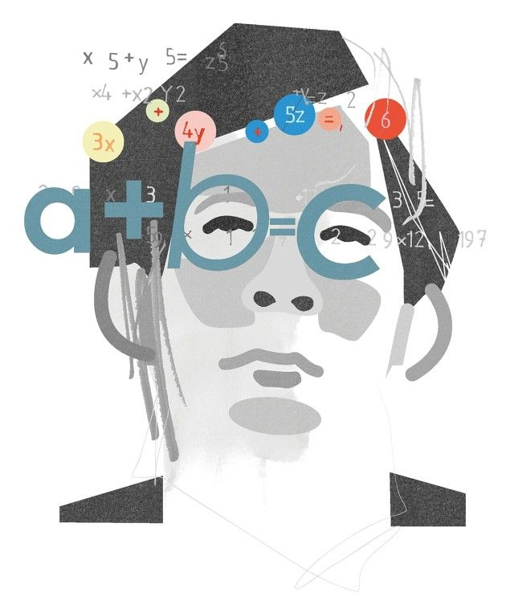

    AMONG NUMBER THEORISTS, THIS IS HIGH DRAMA.

## Controversial Research

Eight years after he first shared it online, Kyoto University mathematician Shinichi Mochizuki’s controversial, 600-page proof for a profound mathematical conjecture has been approved for publication in an academic journal.

But there’s a twist: academic mathematicians around the world didn’t believe that Mochizuki solved the problem, known as the “abc conjecture,” back then, [Nature News reports](https://www.nature.com/articles/d41586-020-00998-2), and they remain unconvinced now. If Mochizuki ends up being right, he could revolutionize number theory. But experts in the field don’t think acceptance in a journal is nearly enough evidence.

## The Problem

The abc conjecture is an unproven — unless, of course, Mochizuki nailed it — mathematical concept with far-reaching implications.

It states that if there are two different numbers that can be divisible entirely into small prime numbers, then the sum of those two numbers is only divisible by a smaller number of larger prime numbers.

## The Issue

Mochizuki shared [four](../assets/pdf/Inter-universal%20Teichmuller%20Theory%20IV.pdf) [massive](../assets/pdf/Inter-universal%20Teichmuller%20Theory%20I.pdf) [preprints](../assets/pdf/Inter-universal%20Teichmuller%20Theory%20II.pdf) [online](../assets/pdf/Inter-universal%20Teichmuller%20Theory%20III.pdf) in 2012, claiming they were a proof of the abc conjecture. But no one has been able to verify his claims — the NYT reports that experts at the time compared the four papers to trying to decipher an alien language. So they remain skeptical that an academic journal managed to succeed where the entire math community failed.

“If the best mathematicians spend time trying to work out what’s going on and fail,” an anonymous mathematician told the NYT, “how can one referee on his own have any chance?”
