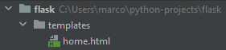
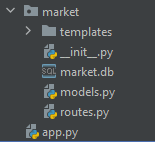

## setup

```python
from flask import Flask

app = Flask(__name__)


@app.route('/')
def hello_world():
    return 'Hello, World!'
```

```bash
set FLASK_APP=market.py
set FLASK_DEBUG=1
flask run
```

## Dynamic route

```python
@app.route('/about/<username>')
def about_page(username):
    return f'<h1>This is about page of {username}</h1>'
```

> <http://127.0.0.1:5000/about/marco>

### Use Templates



> home.html

```html
<h1>Home Page</h1>
```

> app.py

```python
from flask import Flask, render_template

app = Flask(__name__)


@app.route('/')
def home_page():
    return render_template('home.html')
```

### Bootstrap

> <https://getbootstrap.com/docs/5.0/getting-started/introduction/>

## Two routes

```python
@app.route('/')
@app.route('/home')
def home_page():
    return render_template('home.html')
```

## Jinja Template

> app.py

```python
app.route('/market')
def market_page():
    return render_template('market.html', item_name='Phone')
```

> market.html

```html
 <p>{{ item_name }}</p>
```

--

> app.py

```python
@app.route('/market')
def market_page():
    items = [
        {'id': 1, 'name': 'Phone', 'barcode': '893212299897', 'price': 500},
        {'id': 2, 'name': 'Laptop', 'barcode': '123985473165', 'price': 900},
        {'id': 3, 'name': 'Keyboard', 'barcode': '231985128446', 'price': 150}
    ]
    return render_template('market.html', items=items)
```

> market.html

```html
% for item in items %
 <tr>
  <td>{{ item.id }}</td>
  <td>{{ item.name }}</td>
  <td>{{ item.barcode }}</td>
  <td>{{ item.price }}$</td>
 </tr>
% endfor %
```

### Template Inheritance

> base.html

```html
<title>
 % block title %
 % endblock %
</title>

<div class="col-12">
    % block content %
    % endblock %
</div>
```

> home.html

```html
% extends 'base.html' %

% block title %
    Home Page
% endblock %

% block content %
    <h1>Content of the home page.</h1>
% endblock %
```

### More

> app.py

```python
@app.route('/')
@app.route('/home')
def home_page():
    return render_template('home.html')
```

> base.html

```html
<a class="nav-link active" aria-current="page" href="{{ url_for('home_page') }}">Home</a>
```

## SQLAlchemy

> <https://flask-sqlalchemy.palletsprojects.com/en/2.x/>

> app.py

```python
from flask import Flask, render_template
from flask_sqlalchemy import SQLAlchemy

app = Flask(__name__)
app.config['SQLALCHEMY_DATABASE_URI'] = 'sqlite:///market.db'
db = SQLAlchemy(app)


class Item(db.Model):
    id = db.Column(db.Integer(), primary_key=True)
    name = db.Column(db.String(length=30), nullable=False, unique=True)
    price = db.Column(db.Integer(), nullable=False)
    barcode = db.Column(db.String(length=12), nullable=False, unique=True)
    desc = db.Column(db.String(length=1024), nullable=False, unique=True)
```

> python cil

```python
from app import db
db.create_all()
```

### Add data

```python
from app import Item
item1 = Item(name="IPhone 10", price=500, barcode='23243423', desc='desc...')
db.session.add(item1)
db.session.commit()
```

#### Get data

```python
>>> Item.query.all()
[<Item 1>, <Item 2>]
```

> to make it show the name of the item instead of <Item 1>

> app.py

```python
class Item(db.Model):
    id = db.Column(db.Integer(), primary_key=True)
    name = db.Column(db.String(length=30), nullable=False, unique=True)
    price = db.Column(db.Integer(), nullable=False)
    barcode = db.Column(db.String(length=12), nullable=False, unique=True)
    desc = db.Column(db.String(length=1024), nullable=False, unique=True)

    def __repr__(self):
        return f'item {self.name}'
```

### Iterate over the data

```python
>>> for item in Item.query.all():
...     item.name
```

> check availablity

```python
nm = Item.query.filter_by(price=55000).first()
# nm -> None
# if nm & if not nm
```

### Update

```python
admin = User.query.filter_by(username='admin').first()
admin.email = 'my_new_email@example.com'
db.session.commit()

user = User.query.get(5)
user.name = 'New Name'
db.session.commit()
```

### In Viewer

```python
@app.route('/market')
def market_page():
    items = Item.query.all()
    return render_template('market.html', items=items)
```

## Python Package



> \__init__.py

```python
from flask import Flask
from flask_sqlalchemy import SQLAlchemy

app = Flask(__name__)
app.config['SQLALCHEMY_DATABASE_URI'] = 'sqlite:///market.db'
db = SQLAlchemy(app)

from market import routes
```

> routes.py

```python
from market import app
from flask import render_template
from market.models import Item


@app.route('/')
@app.route('/home')
def home_page():
    return render_template('home.html')


@app.route('/market')
def market_page():
    items = Item.query.all()
    return render_template('market.html', items=items)

```

> models.py

```python
from market import db


class Item(db.Model):
    id = db.Column(db.Integer(), primary_key=True)
    name = db.Column(db.String(length=30), nullable=False, unique=True)
    price = db.Column(db.Integer(), nullable=False)
    barcode = db.Column(db.String(length=12), nullable=False, unique=True)
    desc = db.Column(db.String(length=1024), nullable=False, unique=True)

    def __repr__(self):
        return f'item {self.name}'
```

> app.py

```python
from market import app

if __name__ == '__main__':
    app.run(debug=True)
```

## Continue

> <https://youtu.be/Qr4QMBUPxWo?t=8001>

> <https://www.youtube.com/watch?v=Z1RJmh_OqeA>
